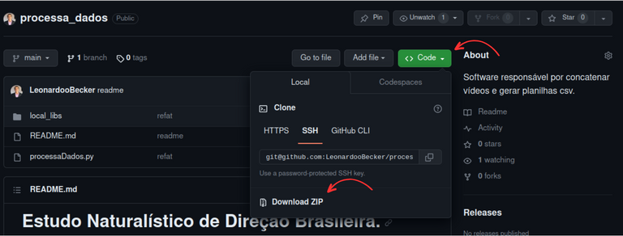

# Estudo Naturalístico de Direção Brasileira.

## Objetivo

-   Este software foi desenvolvido para atender dois principais objetivos:
    - Realizar a concatenação dos vídeos obtidos pela plataforma de coleta.
    - Realizar os cortes no arquivo txt que contém os dados geográficos das gravações, separando pelas respectivas viagens.

## Utilização

Para a utilização do software, primeiramente é necessário ter o mesmo em sua máquina local, do qual isso pode ser feito de duas maneiras distintas:
1.    Baixando o arquivo ZIP disponibilizado neste próprio repositório e fazer a descompactação do mesmo em sua máquina local.
  
2.    Clonando o repositório com o comando:
```
git clone git@github.com:LeonardooBecker/processa_dados.git
```

